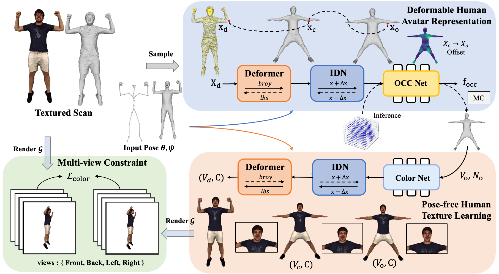
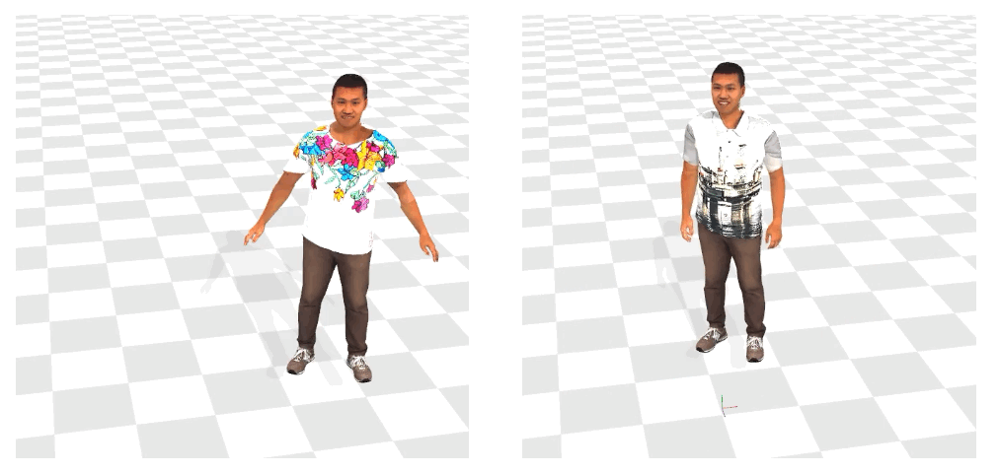

# CtrlAvatar: Controllable Avatars Generation via Disentangled Invertible Networks
[[project](https://1211186431.github.io/CtrlAvatar-web/)][[paper](https://1211186431.github.io/CtrlAvatar-web/static/AAAI25_CameraReady_543.pdf)]

<p align="center"> <br></p>

>  We present CtrlAvatar, a method for generating human avatars driven by pose parameters. CtrlAvatar features a disentangled design that allows it to achieve high-quality results with minimal training data. The model supports editable textures and enables rapid inference.

This codebase supports processing datasets such as [X-Humans](https://github.com/Skype-line/X-Avatar), [CustomHumans](https://github.com/custom-humans/editable-humans), and [4D-Dress](https://github.com/eth-ait/4d-dress).

It also supports two renderer configurations: [PyTorch3D](https://github.com/facebookresearch/pytorch3d) and [Nvdiffrast](https://github.com/NVlabs/nvdiffrast).

---

## Environment Dependencies
See [install](install.md). Alternatively, you can use the environment configuration provided by [X-Avatar](https://github.com/Skype-line/X-Avatar), but some code modifications may be required.

## Quick Demo
<p align="center"> <br></p>
<!-- <p align="center"> <br></p> -->

Download the [data](https://drive.google.com/drive/folders/1hZl5XgEOOc8MhcQfBRQRehCkK2xTRfto?usp=drive_link), extract it and move it to ```data/```. Please download the demo sequences from [X-Avatar](https://github.com/Skype-line/X-Avatar) and modify the ```pkl_dir``` in (demo.yaml)[config/demo.yaml].

Then run:
```
python main.py --mode demo --config /home/ps/dy/CtrlAvatar/config/demo.yaml --subject 00020
```


## Train Geometry
Refer to the [detailed guide](geometry/README.md) for training the geometry module.


## Data Preprocessing
Prepare texture data:

First, modify the `base_path` in the YAML files under the `config` directory to the current project path, and set the `data_path` to the corresponding dataset path. Then, run the following code:
```bash
export PYTHONPATH=$PYTHONPATH:/home/ps/dy/CtrlAvatar

python util/texture_process.py --config /home/ps/dy/CtrlAvatar/config/S4DDress.yaml --subject 00122_Inner
```

## Training
To start training:
```
python main.py --mode train --config /workspace/CtrlAvatar/config/S4DDress.yaml --subject 00122_Inner
```

## Testing
To test the model:
```
python main.py --mode test --config /home/ps/dy/CtrlAvatar/config/S4DDress.yaml --subject 00122_Inner
```

## Edit
Comming soon


## Evaluation
1. Save Multi-view Images
```
python util/save_eval_data.py --subject 00016 --data_path /home/ps/dy/CtrlAvatar/outputs/test/00016/mesh_test --method Ctrl --out_dir /home/ps/dy/ctrl
```

2. Compute Metrics
```
python evaluate.py --subject 00016 --gt_npy /home/ps/dy/eval_aaai25/eval0805/eval_gt/gt_00016.npy --pre_npy /home/ps/dy/eval_aaai25/eval0805/eval_ours/Ours_00016.npy --method Ctrl --out_dir /home/ps/dy
```


## Acknowledgement
This project builds upon the codes from the following excellent research works: [X-Avatar](https://github.com/Skype-line/X-Avatar), [SMPL-X](https://github.com/vchoutas/smplx),  [Editable-Humans](https://github.com/custom-humans/editable-humans), [HaveFun](https://github.com/TIM2015YXH/HaveFun), [Pytorch3d](https://github.com/facebookresearch/pytorch3d), [Nvidiffrast](https://github.com/NVlabs/nvdiffrast). We sincerely thank the authors for their incredible contributions.