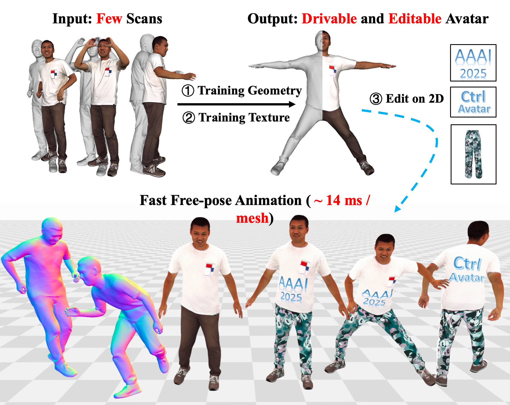

# CtrlAvatar
To address the challenges of lifelike and customizable avatar generation, we present **CtrlAvatar**, a real-time framework for generating controllable avatars using disentangled invertible networks. CtrlAvatar enables high-quality and user-driven avatar customization and generation.



This codebase supports processing datasets such as [X-Humans](https://github.com/Skype-line/X-Avatar), [CustomHumans](https://github.com/custom-humans/editable-humans), and [4D-Dress](https://github.com/eth-ait/4d-dress).

It also supports two renderer configurations: [PyTorch3D](https://github.com/facebookresearch/pytorch3d) and [Nvdiffrast](https://github.com/NVlabs/nvdiffrast).

---

## Train Geometry
Refer to the [detailed guide](geometry/README.md) for training the geometry module.

---

## Data Preprocessing
Prepare texture data:
```bash
export PYTHONPATH=$PYTHONPATH:/home/ps/dy/CtrlAvatar

python util/texture_process.py --config /home/ps/dy/CtrlAvatar/config/S4DDress.yaml --subject 00122_Inner
```

## Training
To start training:
```
python main.py --mode train --config /home/ps/dy/CtrlAvatar/config/S4DDress.yaml --subject 00122_Inner
```

## Testing
To test the model:
```
python main.py --mode test --config /home/ps/dy/CtrlAvatar/config/S4DDress.yaml --subject 00122_Inner
```

## Evaluation
1. Save Multi-view Images
```
python util/save_eval_data.py --subject 00016 --data_path /home/ps/dy/CtrlAvatar/outputs/test/00016/mesh_test --method Ctrl --out_dir /home/ps/dy/ctrl
```

2. Compute Metrics
```
python evaluate.py --subject 00016 --gt_npy /home/ps/dy/eval_aaai25/eval0805/eval_gt/gt_00016.npy --pre_npy /home/ps/dy/eval_aaai25/eval0805/eval_ours/Ours_00016.npy --method Ctrl --out_dir /home/ps/dy
```

## Export Video
1. Switch to an environment with ```ffmpeg``` installed, then run:
```
python util/export_video.py
```

## Acknowledgement
This project builds upon the codes from the following excellent research works: [X-Avatar](https://github.com/Skype-line/X-Avatar), [SMPL-X](https://github.com/vchoutas/smplx),  [Editable-Humans](https://github.com/custom-humans/editable-humans), [HaveFun](https://github.com/TIM2015YXH/HaveFun), [Pytorch3d](https://github.com/facebookresearch/pytorch3d), [Nvidiffrast](https://github.com/NVlabs/nvdiffrast). We sincerely thank the authors for their incredible contributions.