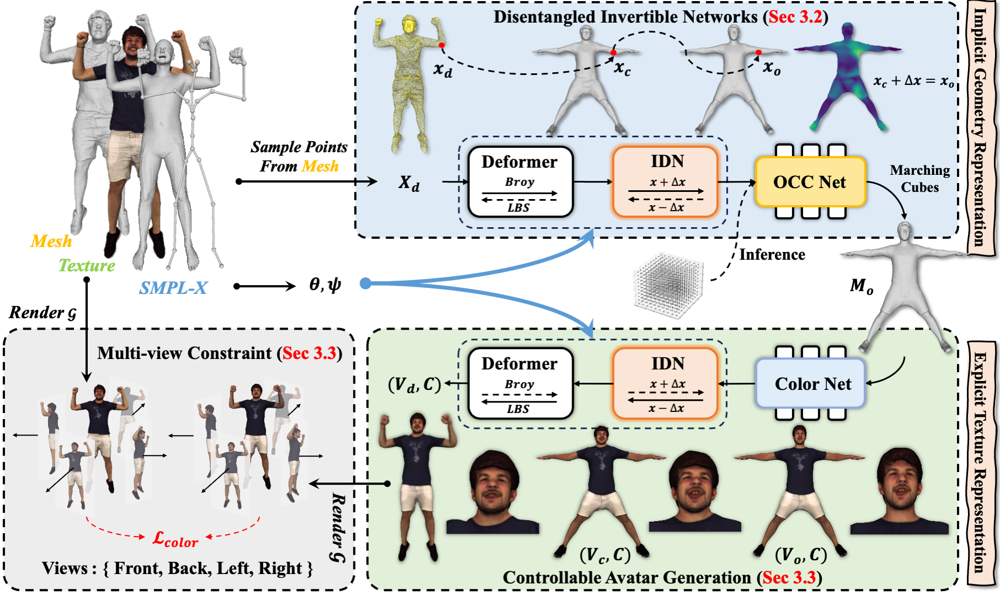

# CtrlAvatar: Controllable Avatars Generation via Disentangled Invertible Networks
[[project](https://1211186431.github.io/CtrlAvatar-web/)][[paper](https://1211186431.github.io/CtrlAvatar-web/static/AAAI25_CameraReady_543.pdf)]

<p align="center"> <br></p>

>  We present CtrlAvatar, a method for generating human avatars driven by pose parameters. CtrlAvatar features a disentangled design that allows it to achieve high-quality results with minimal training data.
---
## Branch Description

This branch is a refactored version of the original code. The original code used in the paper is available in the `main` branch.

### Differences from the `main` Branch

1. **Positional Encoding**  
   Replaced with Hash Encoding.

2. **Texture Prediction Input**  
   Changed to vertices only; normals have been removed.

3. **Rendering**  
   Added random camera viewpoints during rendering.

## Environment Dependencies
The environment requirements for this branch are consistent with the `main` branch. Additionally, you need to install [tiny-cuda-nn](https://github.com/NVlabs/tiny-cuda-nn) and torch_scatter.


## Geometry
Refer to the [detailed guide](geometry/README.md) for training the geometry module.

## Texture
To start training:
```
python launch.py --mode train --config ./config/base.yaml
```

To start testing:
```
python launch.py --mode test --config ./config/base.yaml
```

## Edit cloth
To begin with, render the trained mesh from four different viewpoints by executing:
```
PYTHONPATH=. python preprocessing/prepare_edit.py
```

Next, you can edit the target view images using any method  
(**at least one view must be edited; editing both front and back views is recommended**).

After editing, update the `edit.edit_images_path` field in `base.yaml` accordingly.  
The image filenames should follow the format: `edit_{view}`, where `view` can be one of `[front, back, left, right]`

Finally, run: 
```
python launch.py --mode edit
```


## Acknowledgement
This project builds upon the codes from the following excellent research works: [X-Avatar](https://github.com/Skype-line/X-Avatar), [SMPL-X](https://github.com/vchoutas/smplx),  [Editable-Humans](https://github.com/custom-humans/editable-humans), [HaveFun](https://github.com/TIM2015YXH/HaveFun), [Pytorch3d](https://github.com/facebookresearch/pytorch3d), [Nvidiffrast](https://github.com/NVlabs/nvdiffrast). We sincerely thank the authors for their incredible contributions.